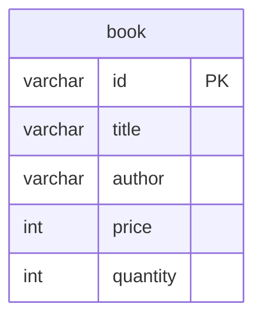

# Bookstore API Server 

## 설계 참고
- 호스팅 서비스는 배포 단계의 제약이므로, 가능하면 코드에는 영향이 없도록 함
  - 호스팅 서비스마다 지원하는 DBMS가 다르므로, 성능상 불이익이 있더라도 가능한 한 표준 SQL을 사용함(ex. 시스템의 UUID는 db에서 문자열 타입으로 관리)

## API
### 책 목록 조회
- Request
  - url: GET /api/books
  - query parameters
    - page: 페이지 번호(필수 아님, 1부터 시작, 기본값 1)
    - size: 페이지별 항목 수(필수 아님, 기본값 10)
    - title: 제목 필터(필수 아님)
    - author: 저자 필터(필수 아님)
  - body: (없음)
- Response
  - 성공
    - http status code: 200 ok
    - body(object list)
      - id: 책 아이디
      - title: 제목
      - author: 저자
      - quantity: 수량
  - 실패 http status code
    - 500 internal server error: 서버 오류

### 책 상세 정보 조회
- Request
  - url: GET /api/books/:id
  - query parameters: (없음)
  - body: (없음)
- Response
  - 성공
    - http status code: 200 ok
    - body(object)
      - id: 책 아이디
      - title: 제목
      - author: 저자
      - price: 가격
      - quantity: 수량
  - 실패 http status code
    - 404 not found: 해당하는 책이 없음
    - 500 internal server error: 서버 오류

### 책 추가
- Request
  - url: POST /api/books
  - query parameters: (없음)
  - body(object)
    - title: 제목
    - author: 저자
    - price: 가격(0 이상)
    - quantity: 수량(0 이상)
- Response
  - 성공
    - http status code: 200 ok
    - body(object)
      - id: 추가한 책 아이디
  - 실패 http status code
    - 400 bad request: 필수 정보 없음(제목 or 저자 or 가격 or 수량) 또는 값이 유효하지 않음(가격 or 수량 오류)
    - 409 conflict: 동일한 제목 및 저자 이름이 이미 존재하는 경우
    - 500 internal server error: 서버 오류

### 책 정보 수정
- Request
  - url: PUT /api/books/:id
  - query parameters: (없음)
  - body(object)
    - title: 제목
    - author: 저자
    - price: 가격(0 이상)
    - quantity: 수량(0 이상)
- Response
  - 성공
    - http status code: 200 ok
  - 실패 http status code
    - 400 bad request: 필수 정보 없음(제목 or 저자 or 가격 or 수량) 또는 값이 유효하지 않음(가격 or 수량 오류)
    - 404 not found: 해당하는 책이 없음
    - 409 conflict: 동일한 제목 및 저자 이름이 이미 존재하는 경우
    - 500 internal server error: 서버 오류

### 책 삭제
- Request
  - url: DELETE /api/books/:id
  - query parameters: (없음)
  - body: (없음)
- Response
  - 성공
    - http status code: 200 ok
  - 실패 http status code
    - 404 not found: 해당하는 책이 없음
    - 500 internal server error: 서버 오류

## ERD
