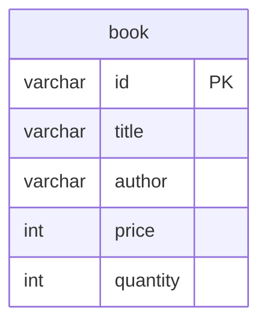

# Bookstore API Server 

## 설치 방법
### 설치 전 준비
- 설치 환경: linux
- 설치 파일 구성
  - docker-compose.yml: docker compose 설정 파일
  - Dockerfile: docker 이미지 설정 파일
  - start.sh: 전체 설치 과정이 정의된 파일(이 파일만 실행하면 설치 및 구동함)
- 사전 준비(준비된 경우 아래 설치로)
  - docker 및 docker compose 설치
    - docker 설치 참조: https://docs.docker.com/engine/install
    - docker compose 설치 참조: https://docs.docker.com/compose/install

### 설치
```shell
$ sh start.sh
```
- 본 시스템은 포트 8080번을 사용하는데, 만약 포트 8080번이 이미 사용 중일 경우, 본 소스의 docker-compose.yml 파일 변경 후 다시 시도
  - app 서비스 ports 항목의 "8080:8080" 중 앞 숫자를 바꾸고 싶은 포트로 변경한 후 다시 시도(ex. 8000으로 변경할 경우 "8000:8080")
- 설치 완료 후 포트포워딩
  - 포트포워딩을 완료해야 프론트엔드에서 사용 가능(localhost 안됨). 포트포워딩한 주소 정보를 프론트엔드에서 사용함(프론트엔드 소스의 README.md 참조)

### 설치 완료 확인
- 아래 명령어를 실행하여 구동중인 컨테이너가 rgt-bookstore, rgt-bookstore-db 총 2개가 있으면 설치 완료됨
```shell
$ docker ps --filter "name=rgt-bookstore"
```
- 다만 상기 명령어는 컨테이너가 설치된 것을 의미하며 이후 구동까지는 시간이 더 걸릴 수 있음

### 설치 실패 대응법
- Error response from daemon: driver failed... port is already in use
  - 설치하려는 port가 이미 사용중임. 상기 설치의 포트 변경 방법을 참고하여 다시 설치

### 테스트
- 브라우저의 주소창에 설치한 호스트 주소(아래 예시의 api-host 부분) 및 포트(아래 예시는 기본값인 8080번을 사용. 상기 설치 과정에서 변경한 경우는 변경한 번호를 사용해야 함), 사용할 api(GET만 가능) 주소를 입력하여 테스트
```
### 책 목록 조회 api 테스트
http://api-host:8080/api/books
```

## 설계 참고
- 호스팅 서비스는 배포 단계의 제약이므로, 가능하면 코드에는 영향이 없도록 함
  - 호스팅 서비스마다 지원하는 DBMS가 다르므로, 성능상 불이익이 있더라도 가능한 한 표준 SQL을 사용함(ex. 시스템의 UUID는 db에서 문자열 타입으로 관리)

## API
### 책 목록 조회
- Request
  - url: GET /api/books
  - query parameters
    - page: 페이지 번호(필수 아님, 1부터 시작, 기본값 1)
    - size: 페이지별 항목 수(필수 아님, 기본값 10)
    - title: 제목 필터(필수 아님)
    - author: 저자 필터(필수 아님)
  - body: (없음)
- Response
  - 성공
    - http status code: 200 ok
    - body(object)
      - page: 검색된 페이지 번호(1부터 시작)
      - size: 페이지별 항목 수
      - totalPages: 전체 페이지 수
      - totalElements: 전체 항목 수
      - isFirst: 첫 페이지인지 여부
      - isLast: 마지막 페이지인지 여부
      - content: 조회된 데이터 목록(object list). title 오름차순, author 오름차순 정렬됨
        - id: 책 아이디
        - title: 제목
        - author: 저자
        - quantity: 수량
  - 실패 http status code
    - 500 internal server error: 서버 오류

### 책 상세 정보 조회
- Request
  - url: GET /api/books/:id
  - query parameters: (없음)
  - body: (없음)
- Response
  - 성공
    - http status code: 200 ok
    - body(object)
      - id: 책 아이디
      - title: 제목
      - author: 저자
      - price: 가격
      - quantity: 수량
  - 실패 http status code
    - 404 not found: 해당하는 책이 없음
    - 500 internal server error: 서버 오류

### 책 추가
- Request
  - url: POST /api/books
  - query parameters: (없음)
  - body(object)
    - title: 제목
    - author: 저자
    - price: 가격(0 이상)
    - quantity: 수량(0 이상)
- Response
  - 성공
    - http status code: 200 ok
    - body(object)
      - id: 추가한 책 아이디
  - 실패 http status code
    - 400 bad request: 필수 정보 없음(제목 or 저자 or 가격 or 수량) 또는 값이 유효하지 않음(가격 or 수량 오류)
    - 409 conflict: 동일한 제목 및 저자 이름이 이미 존재하는 경우
    - 500 internal server error: 서버 오류

### 책 정보 수정
- Request
  - url: PUT /api/books/:id
  - query parameters: (없음)
  - body(object)
    - title: 제목
    - author: 저자
    - price: 가격(0 이상)
    - quantity: 수량(0 이상)
- Response
  - 성공
    - http status code: 200 ok
  - 실패 http status code
    - 400 bad request: 필수 정보 없음(제목 or 저자 or 가격 or 수량) 또는 값이 유효하지 않음(가격 or 수량 오류)
    - 404 not found: 해당하는 책이 없음
    - 409 conflict: 동일한 제목 및 저자 이름이 이미 존재하는 경우
    - 500 internal server error: 서버 오류

### 책 삭제
- Request
  - url: DELETE /api/books/:id
  - query parameters: (없음)
  - body: (없음)
- Response
  - 성공
    - http status code: 200 ok
  - 실패 http status code
    - 404 not found: 해당하는 책이 없음
    - 500 internal server error: 서버 오류

## ERD
